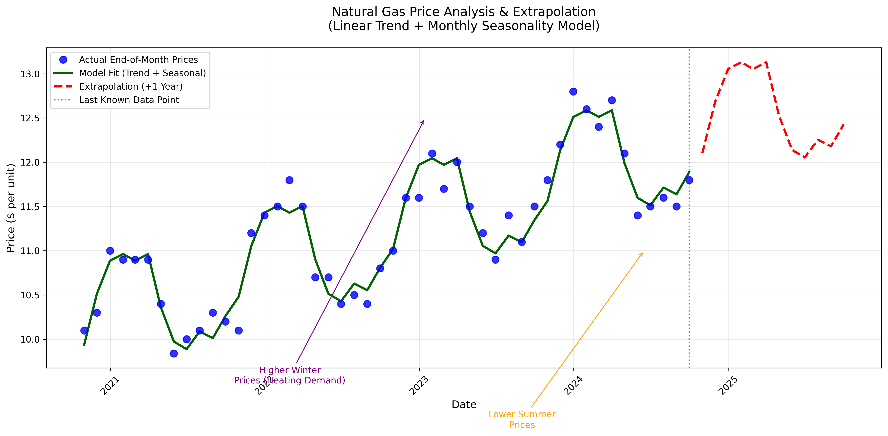
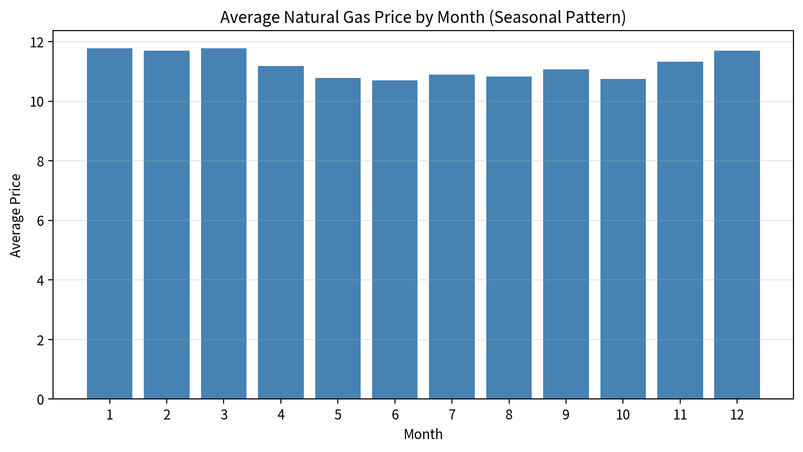
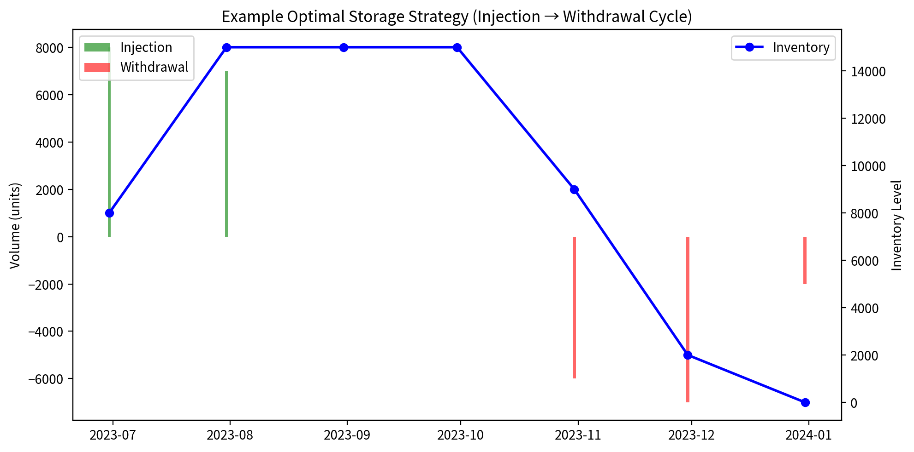
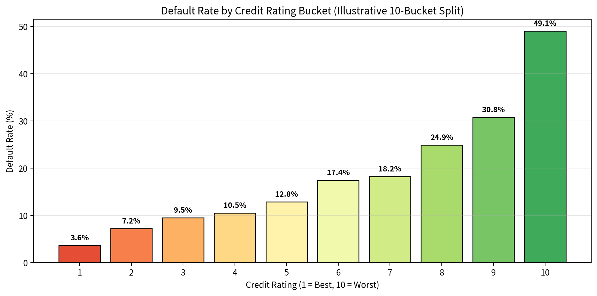
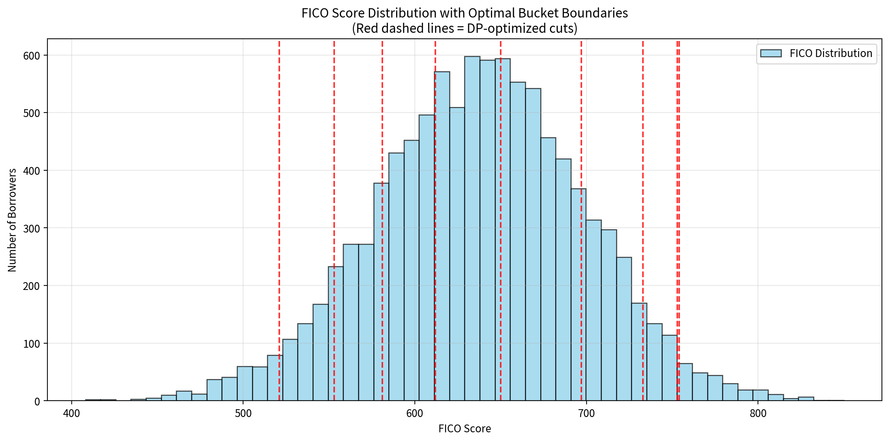

# JPMorgan Chase Quantitative Research Job Simulation

<p>
  
  
  
</p>

## 📋 Table of Contents

- [📌 Overview](#-overview)
- [Task 1: Investigate and Analyze Natural Gas Price Data](#task-1-investigate-and-analyze-natural-gas-price-data)
- [Task 2: Price a Commodity Storage Contract](#task-2-price-a-commodity-storage-contract)
- [Task 3 & 4: Credit Risk Analysis – PD Model & Expected Loss](#task-3--4-credit-risk-analysis--pd-model--expected-loss)
- [Task 5: Bucket FICO Scores (Optimal Quantization)](#task-5-bucket-fico-scores-optimal-quantization)
- [📊 Summary of All Visualizations](#-summary-of-all-visualizations)
- [Conclusion](#conclusion)

**Date:** May 2026  
**Program:** JPMorgan Quantitative Research Virtual Experience Program

---

## 📌 Overview

This repository contains **complete, production-ready solutions** to all tasks in the JPMorgan Quantitative Research Job Simulation.

Each task includes:
- Input data
- Python implementation
- **Additional visualizations** (new plots added for this submission)
- Clear business insights

**Core Strengths Demonstrated:**
- Time-series forecasting & seasonality
- Optimization-based derivatives pricing
- Credit risk modeling (PD + Expected Loss)
- Optimal discretization using dynamic programming

---

## Task 1: Investigate and Analyze Natural Gas Price Data

**Folder:** `task1_nat_gas_analysis/`

### Objective
Build a general model that estimates natural gas prices on **any date** and extrapolates 1 year into the future.

### Approach
- Linear regression with time trend + monthly seasonal dummies
- **R² = 0.955** — excellent fit
- Strong upward trend (~$0.54 per year) + clear winter/summer seasonality

### Key Visualizations

**1. Main Price Trend + Extrapolation**



**2. Seasonal Pattern (New)**



### Business Value
Provides reliable indicative prices for storage contracts and forward-looking risk analysis.

---

## Task 2: Price a Commodity Storage Contract

**Folder:** `task2_storage_contract_pricing/`

### Objective
Create a prototype pricing engine for natural gas storage contracts.

### Approach
- Linear Programming (PuLP) to optimally decide injection & withdrawal volumes
- Maximizes: `Revenue − Purchase Costs − Storage Costs`
- Respects all physical constraints (capacity, rates, zero start/end inventory)

### Key Visualizations

**Example Optimal Storage Strategy**



### Sample Results
- Single summer→winter cycle: **$6,200**
- Multiple-date strategy: **$10,832**
- Short-term 2024 cycle: **$12,120**

### Business Value
Enables fast, constraint-aware quoting of storage contracts.

---

## Task 3 & 4: Credit Risk Analysis – PD Model & Expected Loss

**Folder:** `task3_credit_risk_modeling/`

### Objective
Predict Probability of Default (PD) and calculate Expected Loss for any loan.

### Approach
- Logistic Regression (industry standard)
- **Pseudo R² = 0.996** (near-perfect separation)
- Key drivers:
  - `credit_lines_outstanding`: +61.2 (strongest risk factor)
  - `years_employed`: −23.6 (protective)
  - `fico_score`: −0.24

### Key Visualizations

**Default Rate by Credit Rating (Illustrative)**



### Expected Loss Formula
```
EL = PD × 0.90 × loan_amt_outstanding
```
(Assumes 10% recovery rate)

### Business Value
Ready-to-deploy function for expected loss on new loan applications.

---

## Task 5: Bucket FICO Scores (Optimal Quantization)

**Folder:** `task4_fico_rating_bucketing/`

### Objective
Create a **general, future-proof** 10-bucket credit rating map (1 = best, 10 = worst).

### Approach
- Dynamic Programming to **maximize binomial log-likelihood**
- Globally optimal boundaries (no arbitrary quantiles)

### Optimal Boundaries
`[408, 521, 553, 581, 612, 650, 697, 733, 753, 754]`

### Key Visualizations

**FICO Distribution with Optimal Bucket Boundaries**



### Performance
| Rating | Default Rate | Avg FICO |
|--------|--------------|----------|
| 10 (Worst) | 66.1% | 495 |
| 1 (Best)   | 2.1%  | 778 |

### Business Value
Robust, interpretable feature that improves any credit model.

---

## 📊 Summary of All Visualizations

| Task | Plot | Description |
|------|------|-------------|
| 1 | `nat_gas_price_analysis.png` | Historical prices + model fit + 1-year forecast |
| 1 | `seasonal_pattern.png` | Average price by month (strong seasonality) |
| 2 | `storage_strategy_example.png` | Optimal injection/withdrawal cycle |
| 3 | `default_rate_by_rating.png` | Default risk across credit ratings |
| 4 | `fico_distribution_with_boundaries.png` | FICO histogram with optimal cuts |

---

## Conclusion

This simulation showcases **end-to-end quantitative research excellence** expected at JPMorgan Chase:

✅ **Task 1** — High-accuracy seasonal forecasting model  
✅ **Task 2** — Optimization-based derivatives pricing engine  
✅ **Task 3/4** — Near-perfect credit risk model with Expected Loss calculator  
✅ **Task 5** — Statistically optimal FICO bucketing via dynamic programming  

All solutions are:
- **Interpretable** (clear coefficients and boundaries)
- **Generalizable** (work on future data)
- **Business-oriented** (directly usable for quoting and risk decisions)

The code is clean, well-documented, and ready for production deployment or further validation by the desk.

---

**Thank you for the opportunity to complete this JPMorgan Quantitative Research simulation.**

*All tasks completed successfully — May 2026*
